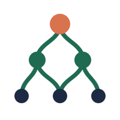

# familia



**Federated Agents Mesh for Intelligent Local Interoperable Autonomy** · *Federación de Agentes Multi-Inteligentes Locales Interoperables Autónomos*

Your models and data stay on your machines. A file, context, or result moves across a boundary only when you tell it to.

familia is a **topology coordinator**. It doesn't replace your inference server or your agents. It pins them, checks them out side by side, and wires them into one graph you control: llama.cpp model servers, the green-roomz alias gateway, the green-agentz fleet, and agents such as hermes-agent, across the machines you own.

> **Status:** pre-release (`v0.1.0-rc2`). Linux is the tested platform. **Want to help test? Start with [TESTING.md](TESTING.md).** See [Platform status](#platform-status) and [Known issues](docs/known-issues.md).

---

## Quick start

**Linux, macOS, Termux (Android):**

```sh
curl -fsSL https://raw.githubusercontent.com/brianreborn/familia/main/install.sh | sh
```

That is the first of two clicks. The second is a one-word acknowledgement of the voluntary contribution notice (type `yes`). You never have to pay. For unattended installs, set `INSTALL_ACK=yes`.

*Windows: one-click `install\windows\install.bat` (wraps `install\windows\install.ps1`), plus `scripts\windows\start.bat` and an opt-in logon task (`scripts\windows\install-task.ps1`); see docs/windows.md. Termux and desktop Linux installers live in `install/termux/` and `install/linux/`.*

The installer:

1. clones familia into `~/familia` (override with `INSTALL_PREFIX`),
2. runs `scripts/configure.sh`, which checks out every sub-project in [`pins.txt`](pins.txt) at its pinned revision,
3. starts `./start.sh` (skip with `INSTALL_NO_START=1`).

When the server is ready, open the chat UI at **http://127.0.0.1:9931/?model=chat**, or at whatever URL the launcher prints if 9931 is taken. On first visit, click **Enter API Key** and paste the key printed in the terminal.

Already have a checkout?

```sh
./start.sh
```

**Windows:** familia doesn't ship a top-level Windows installer yet ([#17](https://github.com/brianreborn/familia/issues/17)). The model server sub-project, [code-bootstraps-llama.cpp](https://github.com/brianreborn/code-bootstraps-llama.cpp), has its own PowerShell 5.1 installer, which is documented as not yet re-tested.

---

## Architecture

familia is a **graph**. Nodes have named *hooks*, and hooks connect in pairs. Data moves along an edge. Control messages are addressed to a node and don't have to follow the edges. This is the NETGRAPH split: the data plane is the graph, and the control plane is a message you can send to any node while data keeps moving.

```
               ┌───────────────── you ─────────────────┐
               │   web UI :9931   ·   agents / TUIs     │
               └───────────┬───────────────────────────┘
                           │  route names: chat · coder · route · translate · …
                ┌──────────▼──────────┐
                │  room  (green-roomz)│  one stable alias → one backend; HANDOFF back to `route`
                └──────────┬──────────┘
          ┌────────────────┼──────────────────┐
   ┌──────▼──────┐  ┌──────▼──────┐   ┌───────▼───────┐
   │ model chat  │  │ model coder │   │ model route   │   llama-server (router mode)
   └──────┬──────┘  └──────┬──────┘   └───────────────┘   code-bootstraps-llama.cpp
          │ weights         │ kv
   ┌──────▼─────────────────▼──────┐        ┌──────────────┐   ┌─────────────┐
   │ store  (local · ssh · nfs ·   │        │ agent / swarm│   │ reach       │
   │        rsync · torrent · zfs) │        │ green-agentz │   │ Agent-Reach │
   └───────────────────────────────┘        └──────────────┘   └─────────────┘
```

- **Node types** (from `pins.txt`): `model`, `agent`, `agency`, `room`, `swarm`, `store`, `reach`.
- **Transports**: `local`, `ssh`, `nfs`, `rsync`, `bittorrent`, `zfs`. On this branch they are names in the graph only; an SSH nexus and BitTorrent tracker proof of concept is on the unmerged `feat/transport-poc` branch.
- **Route names** are single English words for the job: `chat` (front door), `coder` (handoff target), `route` (small resident dispatcher), `translate`. Specialist routes (`vision`, `transcribe`, `speak`, `draw`, `embed`, `rerank`, `safety`, `guard`) exist only when they are declared and their pinned weights are on disk. A file appearing on disk doesn't create a route by itself.
- **The user owns every edge.** An environment variable, a command-line flag, or a saved setting always wins. The system may *suggest* an edge, and it never opens one on its own.
- **Configuration is a declarative graph.** [`graph.yaml`](graph.yaml) declares every model node and agent explicitly; [`scripts/validate_graph.py`](scripts/validate_graph.py) checks it against the measured host and fails loudly instead of quietly picking another model or inflating context. See [docs/configuration-graph.md](docs/configuration-graph.md). `start.sh` does not read the graph yet; today the graph is consumed by `scripts/hermes.sh` (and `validate_graph.py --args NODE` prints the `llama-server` command line for a node).

For the full design (transaction blocks, `/local` and `/remote`, snapshots as cache coherence, least privilege), read [DESIGN.md](DESIGN.md).

---

## Sub-projects

The sub-projects keep their own repositories and licenses. familia pins each one by revision in [`pins.txt`](pins.txt). They are pins, not submodules. Nothing is vendored. `scripts/configure.sh` checks them out next to the top-level tree, or links a sibling checkout that already exists.

| Pin (`pins.txt`) | Role | Repository |
|---|---|---|
| `code-bootstraps-llama.cpp` | Models and the agent: `llama-server` router, model fetch/verify, `/local`, `/remote`, installers, settings panel | [brianreborn/code-bootstraps-llama.cpp](https://github.com/brianreborn/code-bootstraps-llama.cpp) |
| `green-roomz` | Alias gateway: one stable name in front of each backend | [brianreborn/green-roomz](https://github.com/brianreborn/green-roomz) |
| `green-agentz` | Agent fleet (green-brainz, green-fleetz, green-zkillz) | [brianreborn/green-agentz](https://github.com/brianreborn/green-agentz) |
| `green-agency` | **Retired.** Kept for historical specs; not the fleet | [brianreborn/green-agency](https://github.com/brianreborn/green-agency) |
| `agent-reach` | External reach tools, pinned and not vendored | [Panniantong/Agent-Reach](https://github.com/Panniantong/Agent-Reach) |
| `llama-server__nace-ai__edlm` | Experimental runtime: DReX-DLM diffusion engine. Cloned only when an `ENGINE_*` setting asks for it | [nace-ai/llama.cpp](https://github.com/nace-ai/llama.cpp) (branch `edlm`) |

**Used but not pinned:** [hermes-agent](https://github.com/NousResearch/hermes-agent). Run it through the graph harness:

```sh
scripts/hermes.sh                 # validate graph, start the coder node if needed, launch hermes
scripts/hermes.sh --render-only   # only write the generated hermes config
```

The harness validates `graph.yaml`, renders a separate `HERMES_HOME` under `~/.cache/familia/hermes-<agent>` (it only reads `~/.hermes`, never writes it), sets `context_length` to the node's exact per-slot context (65,536 on the `coder` node), turns compression on, keeps every auxiliary task on local nodes, and starts the node's `llama-server` from `validate_graph.py --args` if it is not already up. This replaces the old manual advice for [#19](https://github.com/brianreborn/familia/issues/19) (16,384-token slot with compression off looping on HTTP 400).

Alternative engine builds follow the `<executable>__<author>__<branch>` naming scheme (for example `llama-server__ggerganov__master`), and each build lives in its own `bin/llama__<author>__<branch>/` directory so shared libraries can't collide. Building alternative engines from these pins is still TBD; `configure.sh` only clones them. Separately, the graph runs **official llama.cpp release builds side by side**: `b11374` serves `coder` (qwen35) and `b11539` serves `embed` (embeddinggemma-2), each declared under `runtimes:` in `graph.yaml` with the architectures it was load-tested on. A node whose GGUF architecture isn't listed for its runtime fails validation.

---

## Configuration

Shell environment variables always take precedence over saved settings.

- **Settings panel (browser):** `python3 scripts/panel.py` serves http://127.0.0.1:9932. It proxies the code-bootstraps-llama.cpp panel and writes `code-bootstraps-llama.cpp/.cache/panel.env`.
- **Settings in the terminal:** `sh scripts/configure.sh -i`. Without `-i` it only syncs pins.
- **Common variables:** `PORT`, `PROFILE` (`lowram` | `moderate` | `default`), `CTX`, `CODER_CTX`, `MODELS_MAX`, `TOOLS`. These are handed to the model server. See the [code-bootstraps-llama.cpp README](https://github.com/brianreborn/code-bootstraps-llama.cpp#readme) for the full list.
- **Detaching:** `DETACH_MODE=foreground|nohup|tmux|screen ./start.sh`. On Termux the default switches to tmux, then screen, then nohup, so the server survives when the terminal closes, and a wake lock is taken when `termux-wake-lock` is installed. tmux and screen sessions are named `familia-server`. nohup logs go to `.cache/server.log`.

---

## Implementation status

What is on [`fix/config-graph`](https://github.com/brianreborn/familia/tree/fix/config-graph) (the base of this docs branch) versus what lives only on unmerged feature branches. Nothing here is on `main` until those branches merge.

| Feature | Where | Status |
|---|---|---|
| Declarative graph `graph.yaml` (schema v1) + `scripts/validate_graph.py` | fix/config-graph | Implemented; validator checks runtimes, GGUF arch, agent `context_length`, prompt-cache size, RAM |
| hermes harness `scripts/hermes.sh` / `hermes_harness.py` | fix/config-graph | Implemented; compaction self-test (`--selftest-compaction`) not yet completed on miryam |
| Side-by-side llama.cpp runtimes (b11374 coder, b11539 embed) | fix/config-graph | Implemented |
| RAM safety reserve (`reserve_ram_mib: 3072` on miryam, ~2 GiB free floor on hosts < 8 GiB) | fix/config-graph | Implemented — see [docs/ram-safety.md](docs/ram-safety.md) |
| Android script fixes (#14, #15, #18), repo rename (#16), Windows doc cleanup (#17) | fix/config-graph | Implemented, not merged |
| Typed graph schema v2: multi-host, GPU fields, speculative edges, qodesh host, `pentests` type (launch-test only) | [feat/graph-types](https://github.com/brianreborn/familia/tree/feat/graph-types) | Unmerged |
| Transports PoC: SSH nexus, private BitTorrent tracker | [feat/transport-poc](https://github.com/brianreborn/familia/tree/feat/transport-poc) | Unmerged proof of concept (loopback-tested) |
| `scripts/scale_down.py` (published GGUF / `llama-quantize`; LittleBit TBD) | [feat/scale-down](https://github.com/brianreborn/familia/tree/feat/scale-down) | Unmerged |
| `isolated_remote` compute design | [feat/isolated-compute](https://github.com/brianreborn/familia/tree/feat/isolated-compute) | Design doc only |

---

## Platform status

| Platform | Status |
|---|---|
| Linux x86_64 | Tested |
| Termux (Android) | Server runs; detach and wake lock handled by `start.sh`. Android fleet-node scripts are being fixed ([#14](https://github.com/brianreborn/familia/issues/14), [#15](https://github.com/brianreborn/familia/issues/15), [#18](https://github.com/brianreborn/familia/issues/18)) |
| macOS | Expected to work through the POSIX installer; untested |
| Windows | No top-level installer yet ([#17](https://github.com/brianreborn/familia/issues/17)) |

---

## Safety model

- **`/local` and `/remote`** (provided by code-bootstraps-llama.cpp's agent). `/local` runs local TUIs (grok, agy, claude, codex, `exec`) under your own user. `/remote` is an advisor for stuck sessions. It never receives your local tools or API key, and auto mode is off until `/remote on`.
- **Transactions:** `begin`, `commit`, `rollback`, `status`. Rollback undoes declared local writes from snapshot before-images. It can't recall a reply or tool call that has already left the machine, and `status` reports that case as `heuristic`.
- **Snapshots as cache coherence:** KV and slot dumps are tied to the exact engine build that wrote them. A different branch or engine gets the cold filesystem state only, and its KV is recomputed.
- **Least privilege:** everything runs as your user. There are no `NOPASSWD` sudo rules. A helper that needs one right uses it and drops it.

---

## Documentation

| Doc | What's in it |
|---|---|
| [MANUAL.md](MANUAL.md) | Install, administer, use |
| [DESIGN.md](DESIGN.md) | The graph, transactions, transports, snapshots |
| [docs/configuration-graph.md](docs/configuration-graph.md) | Declarative model/agent graph: what is implemented, what is planned |
| [docs/ram-safety.md](docs/ram-safety.md) | RAM reserve rule and validator checks |
| [docs/announcements/](docs/announcements/) | Release-note and announcement **drafts** (placeholders, not published) |
| [docs/known-issues.md](docs/known-issues.md) | Current problems and workarounds |
| [docs/announcements/CHANGELOG.md](docs/announcements/CHANGELOG.md) | Release notes |

---

## License

Code in this repository is under the **Light-ware License** ([LICENSE](LICENSE)): the 4-clause BSD license plus a voluntary invitation to help with rent, groceries, or utilities. Declining doesn't affect your rights. Required advertising notice: *"This product includes software developed by Brian Fundakowski Feldman."*

Sub-checkouts keep their own licenses (for example, llama.cpp stays MIT). Model weights carry their own licenses. The default general model's license, for example, is printed when it is downloaded.

---

## Issues

| Area | Tracker |
|---|---|
| familia topology and graph | https://github.com/brianreborn/familia/issues |
| Models, server, installers, agent | https://github.com/brianreborn/code-bootstraps-llama.cpp/issues |
| green-roomz gateway | https://github.com/brianreborn/green-roomz/issues |
| green-agentz fleet | https://github.com/brianreborn/green-agentz/issues |
| green-agency (retired) | https://github.com/brianreborn/green-agency/issues |

Agent-Reach issues belong on [Panniantong/Agent-Reach](https://github.com/Panniantong/Agent-Reach). Upstream llama.cpp issues belong on [ggml-org/llama.cpp](https://github.com/ggml-org/llama.cpp).
