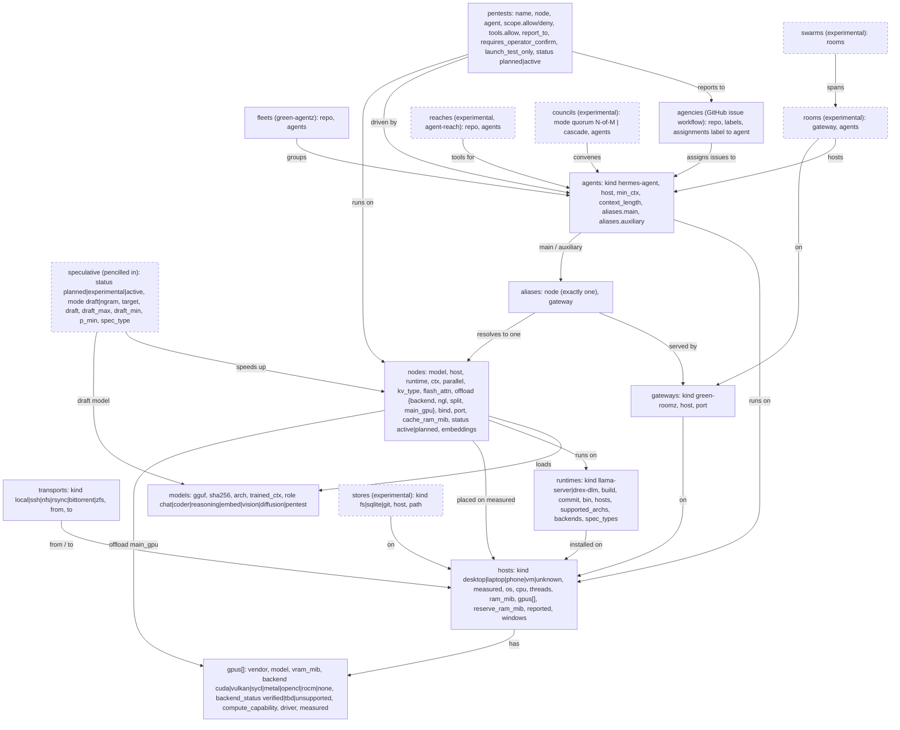

# familia graph types (graph.yaml v2)

`graph.yaml` declares the whole topology: which hosts exist, what runs where,
which model sits behind each route name, and which agents use them. Every
section is a **type** registered in `scripts/graph_types.py`. Every field is
required unless it's marked optional, and nothing has a default. If the graph
doesn't fit the hardware, a runtime, or an agent, the validator fails loudly
instead of choosing something on its own.

```sh
python3 scripts/validate_graph.py              # schema + GGUF metadata + RAM budget
python3 scripts/validate_graph.py --no-files   # schema only (CI, other hosts)
python3 scripts/validate_graph.py --verify-sha # also hash GGUFs against models.*.sha256
python3 scripts/validate_graph.py --args coder # llama-server args for node "coder"
python3 -m pytest tests
```

## Type map



## Rules the validator enforces

| Type | Rules |
|---|---|
| host | `gpus` is required on every host (`[]` when unknown). `measured: true` requires os, cpu, threads, ram_mib, gpus, reserve_ram_mib. `measured: false` must not carry numeric facts and cannot host active nodes; numbers someone else reported go in `reported:` with a `source`. `os: windows` requires a `windows` block: repo_path, models_path, runtime_path, startup (scheduled-task, start.bat, service, manual, or tbd), wake. Standing RAM rule: never aim for high utilization; miryam reserve is 3072 (`docs/ram-safety.md`). |
| gpu | Every GPU entry needs vendor, model, vram_mib, backend, backend_status and measured. If `measured: false`, vram_mib must be null and backend_status can't be `verified`. A measured GPU must give vram_mib, using 0 for a shared-memory iGPU. `kind: unknown` is only allowed while unmeasured. |
| transport | `local` must have from == to; every other kind must link two different hosts. |
| runtime | `commit` must be a git sha, since a branch name isn't a pin. `supported_archs` lists only archs verified to load on that build. `backends` lists what the build was compiled with and must include cpu. `spec_types` lists the `--spec-type` values the build accepts. Several builds can be deployed side by side; `--check-runtimes` runs each `bin --version` and checks the commit. |
| model | `sha256` is 64 hex characters or the literal `unmeasured`. With files present, `arch` and `trained_ctx` must match the GGUF metadata. |
| node | The host must be measured and the runtime installed on it. The model's arch must be in the runtime's `supported_archs`, which catches gemma-embedding2 on b11374. ctx % parallel == 0, per-slot ctx <= trained_ctx, planned nodes skip the placement, runtime and file checks, and ports must be unique per host. With files present: cache_ram_mib >= per-slot prompt state; `estimated_used + reserve_ram_mib` must be <= `ram_mib`; and on hosts with `ram_mib < 8192`, free-after-estimate must be >= 2048 MiB (see `docs/ram-safety.md`). |
| offload | backend is `cpu` (which needs ngl 0) or a GPU backend. The backend must be in the runtime's `backends`, and split must be one of none, layer, row or tensor (`-sm`). ngl > 0 needs `main_gpu` to be a measured GPU on the host with that backend and `backend_status: verified`. With files present, the share of weights plus KV given by ngl/(layers+1) must fit in vram_mib. qodesh's 8600 GT is `backend: none`, so offload there is rejected. |
| speculative | Experimental, pencilled in. `mode: draft` loads a draft model inside the target's llama-server (`-md`, `--spec-draft-n-max`, `--spec-draft-n-min`, `--spec-draft-p-min`, `-ngld`, `-ctkd/-ctvd`; the old `--draft-max/--draft-min` were removed upstream, as verified in the `--help` of b11374 and b11539). It requires draft_max >= draft_min and 0 <= p_min <= 1, and the draft can't be the target model. With files present, the tokenizer model, vocab size and sha256 of the token list must match the target's GGUF, and the draft weights plus draft KV count toward the host's RAM budget. `mode: ngram` is model-free lookup decoding (`--spec-type ngram-mod`, `ngram-simple`, etc.) and takes no draft fields. Either way, the spec_type must be in the target runtime's `spec_types`. A target can have only one `active` speculative entry. |
| alias | Resolves to exactly one node: a string, not a list, and duplicate YAML keys are rejected. If the gateway and node are on different hosts, a non-local transport must link them. |
| agent | Roles `main` and `auxiliary` are both required, each mapped to exactly one alias. Every role's per-slot ctx must be >= min_ctx, and `context_length` must equal the main alias's per-slot ctx. |
| fleet | Every listed agent must exist. |
| agency | `repo` is owner/name, and assignments map labels from `labels` to existing agents. |
| room, swarm, store, reach, council | Experimental. They need `experimental: true`. Council `quorum` needs 1 <= quorum <= len(agents). `cascade` runs agents in list order and takes no quorum. |

| pentest | Legitimate, operator-authorized testing of the owner's fleet — not attack tooling. `scope.allow` / `scope.deny` are lists of graph host names, CIDRs/IPs, or http(s)/ssh URLs (empty allow = nothing allowed). `tools.allow` is an explicit tool-name list with no wildcards. Network/exec tools (nmap, shell, ssh, curl, …) require a non-empty `scope.allow`. `status: active` requires non-empty `scope.allow`, `requires_operator_confirm: true`, and a node whose model has `role: pentest`. `launch_test_only: true` is required: automation may only validate → start → healthcheck → stop; never live scans, exploits, or network probes in tests. See `docs/pentest-models.md`. |

Unknown sections and unknown fields are errors, so a typo can't quietly do nothing.

## Adding a refined or new type

A new type is one registry entry plus, optionally, one checker function in
`scripts/graph_types.py`:

```python
def check_probe(g, name, p, errs):
    if p["interval_s"] < 5:
        errs.append(f"probes.{name}: interval_s {p['interval_s']} < 5")

TYPES["probes"] = T({
    "target":     req("ref", ref="nodes"),   # must name an existing node
    "interval_s": req("int", min=1),
    "experimental": req("bool"),
}, check_probe, experimental=True, doc="health probe")
```

Field kinds: `str`, `int` (with `min`), `bool`, `enum` (with `choices`), `sha`,
`list` (non-empty strings), `ref`/`refs` (names in another section), and `map`.
Wrap a field in `opt(...)` only when leaving it out has a defined meaning, not
to supply a default.

To **refine** an existing type, such as a new model role, host kind, or
transport kind, add the value to that field's `choices`, add any rules for it
to the type's checker, and add a test in `tests/test_graph_types.py`. To
promote an experimental type, set `experimental=False`, drop its
`experimental` field, and write its real cross-checks. Add the new type to
`REQUIRED_SECTIONS` only if every graph must have it.

## Hosts and GPUs today

| host | os | GPU | backend | status | measured |
|---|---|---|---|---|---|
| miryam | linux | Intel HD 620 (shared RAM) | vulkan or sycl | tbd | no (the host is measured) |
| qodesh | windows 10 | GeForce 8600 GT, 256 MiB, CC 1.1, driver 341.92 | none | unsupported | yes |
| shalom | ? | unknown (`gpus: []`) | | | no |
| godslove | freebsd-15 | Ironlake / NVS | none | unsupported (green-roomz #5) | no |
| phone7 | android 16 (Galaxy A57, 192.168.1.7) | Samsung Xclipse 550, shared RAM, Vulkan 1.4.304 (driver 25.4.7) | vulkan (OpenCL blocked) | tbd | yes |
| phone8 | android 16 (Galaxy A57, 192.168.1.8) | Samsung Xclipse 550, shared RAM, Vulkan 1.4.304 (driver 25.4.7) | vulkan (OpenCL blocked) | tbd | yes |

qodesh is worth having for its 16 GB of RAM: it can hold bigger CPU-only models than miryam, at about 3 tok/s (green-roomz #4). `nodes.qodesh-resident` is pencilled in with `status: planned` until a Windows llama.cpp build is declared in `runtimes` and its `windows.startup` method is picked.

## Pentest (authorized fleet testing)

`pentests` is a top-level type for **operator-authorized testing of systems the
owner controls**. It replaces the old LESSONS-LEARNED advice to hide the role as
metadata on a generic task node for the declarative graph (the android scripts
still say `--role pentest` until #15 lands the missing helpers).

Unplaced model options from the survey (only what the user has actually
considered — nothing invented) live in [`docs/pentest-models.md`](pentest-models.md). Every model, placed or not, is listed in [`docs/models-catalog.md`](models-catalog.md).
Today that is Dolphin3-Cyber-8B; WhiteRabbitNeo / Lily / DeepHat / KaliGPT were
searched and not found in the user's RTs.

## meshes (transport PoC, #22)

Multi-member transports live in `meshes:` (`type: ssh` nexus hub or `type: bittorrent` private swarm, `members:` are host names). Point-to-point links stay in `transports:` (kind/from/to). Hosts that are mesh members must declare `addr`, `user` and `port`; passwords are never allowed. Detailed checks: `scripts/transport_graph.py`; see `docs/transport-poc.md`.

## Legacy SM11 (qodesh)

- GPU backend `cuda-sm11-ptx`: hand-written PTX + CUDA driver API on compute 1.1.
- Runtime kind `sm11-legacy`; model role `decision` for always-active draft/decision paths.
- Validator skips GGUF checks for `.bin` / `sm11-legacy` checkpoints.

